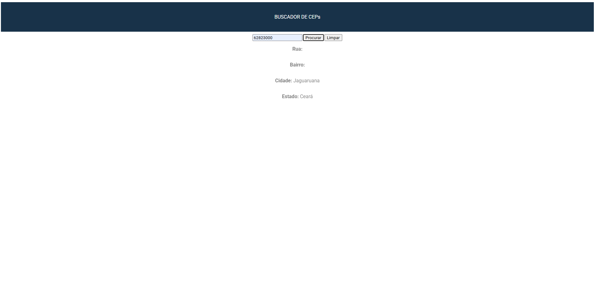

 <!-- criar um arquivo README.md para explicar o projeto -->

# Projeto buscador de Ceps

O objetivo do projeto é pesquisar 
CEPs em uma API chamada http://viacep.com.br

## Design do projeto



## API utilizada

A API utilizada http://viacep.com.br retorna um json 
contendo as seguintes informações para um 
CEP de exemplo 62823000:

```
{
  "cep": "62823-000",
  "logradouro": "",
  "complemento": "",
  "unidade": "",
  "bairro": "",
  "localidade": "Jaguaruana",
  "uf": "CE",
  "estado": "Ceará",
  "regiao": "Nordeste",
  "ibge": "2307007",
  "gia": "",
  "ddd": "88",
  "siafi": "1441"
}

```

## Funcionalidades

- [x] Busca do CEP
- [x] Limpar dados
- [ ] Melhorar o design
- [ ] Responsividade
- [ ] Rodapé

### Observações
> [!NOTE]
> Projeto feito na disciplina de programação web I do curso de ADS do IFCE de Jaguaruana.

> [!IMPORTANT]
> Alguns CEPs podem não conter todas as informações.

## Contatos

Email: kellymariana0103@gmail.com

